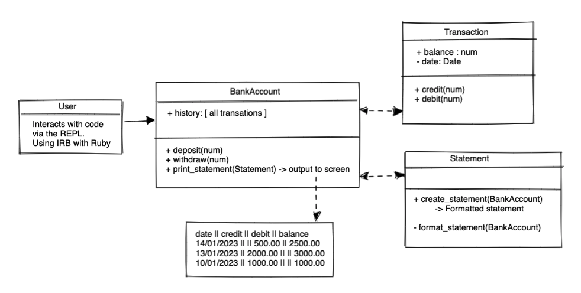

# Bank_tech_test

## Description
Second submission for Bank tech test. A simple program to emulate a bank account. This project is for demonstrating basic TDD and OOP principles, for tech test practise. The project is in Ruby and can be run locally in irb.

* Acceptance criteria demonstrated in IRB with automatic date generation : 


## To run
* To install code and run locally:
 `git clone https://github.com/mmguinness/Bank_tech_test.git`
* Run `bundle install`
* Run `rpsec` to test
* Run `irb` to interact with code and require Ruby files:
```
require './lib/bank'
require './lib/account'
require './lib/statement'
```

## Specification

### Requirements

* You should be able to interact with your code via a REPL like IRB or Node.  (You don't need to implement a command line interface that takes input from STDIN.)
* Deposits, withdrawal.
* Account statement (date, amount, balance) printing.
* Data can be kept in memory (it doesn't need to be stored to a database or anything).

### Acceptance criteria

**Given** a client makes a deposit of 1000 on 10-01-2023  
**And** a deposit of 2000 on 13-01-2023  
**And** a withdrawal of 500 on 14-01-2023  
**When** she prints her bank statement  
**Then** she would see

```
date || credit || debit || balance
14/01/2023 || || 500.00 || 2500.00
13/01/2023 || 2000.00 || || 3000.00
10/01/2023 || 1000.00 || || 1000.00
```

## Process

* Aim to use a TDD approach to completing the project:
   - Plan, Test, Implement, Refactor, Commit

* Outline domain model:


* Following review, redesign of domain model: 


