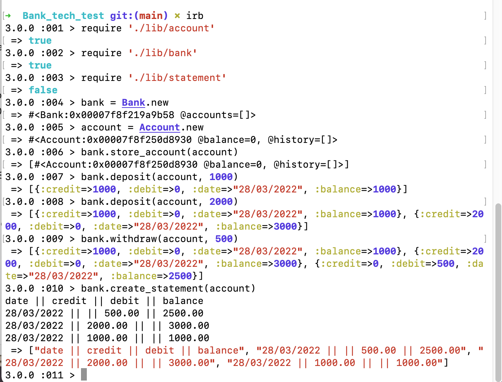
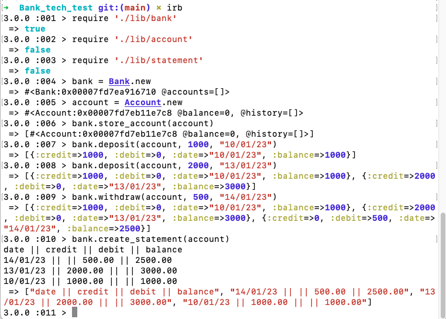
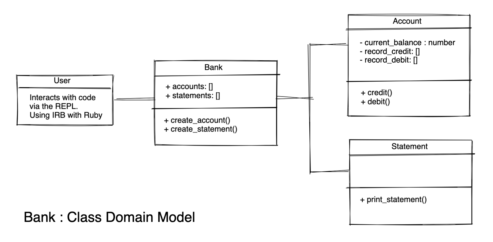
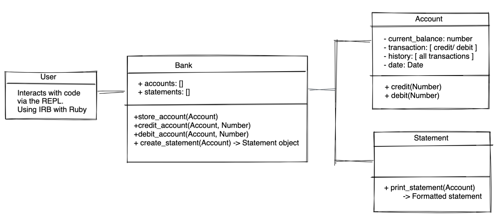
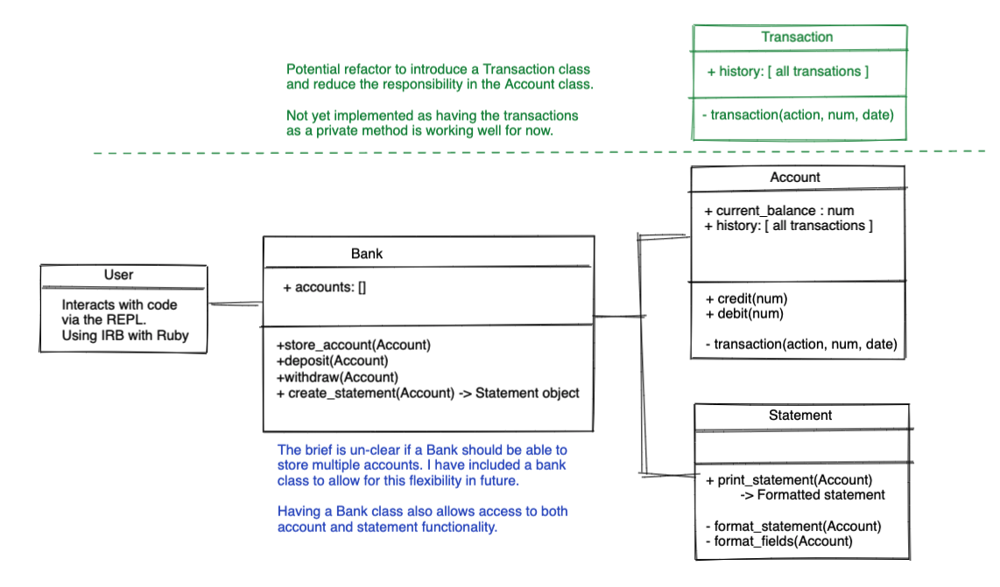

# Bank_tech_test

## Description
* First submission for Bank tech test, a simple bank app that can be run in IRB in your terminal.

* Acceptance criteria demonstrated in IRB with automatic date generation : 


* Acceptance criteria demonstrated in IRB with dates provided to match example : 



## To run
* To install code and run locally:
 `git clone https://github.com/mmguinness/Bank_tech_test.git`
* Run `bundle install`
* Run `rpsec` to test
* Run `irb` to interact with code and require:
```
require './lib/bank'
require './lib/account'
require './lib/statement'
```

## Specification

### Requirements

* You should be able to interact with your code via a REPL like IRB or Node.  (You don't need to implement a command line interface that takes input from STDIN.)
* Deposits, withdrawal.
* Account statement (date, amount, balance) printing.
* Data can be kept in memory (it doesn't need to be stored to a database or anything).

### Acceptance criteria

**Given** a client makes a deposit of 1000 on 10-01-2023  
**And** a deposit of 2000 on 13-01-2023  
**And** a withdrawal of 500 on 14-01-2023  
**When** she prints her bank statement  
**Then** she would see

```
date || credit || debit || balance
14/01/2023 || || 500.00 || 2500.00
13/01/2023 || 2000.00 || || 3000.00
10/01/2023 || 1000.00 || || 1000.00
```

## Process

* Aim to use a TDD approach to completing the project:
   - Plan
   - Test
   - Implement
   - Refactor
   - Commit

* Outline domain model:


* I have added the option of providing the date with the transaction. This was so that I could replicate the example given in the acceptance criteria (which has transactions on different days). On reflection, a bank would not allow you to do this, so I might take this out at a later stage. 

* Thinking about the depency injection, I have refactored my code so the Account instance is now passed into the Bank instance, rather than being created inside the class. I think this is clearer to understand and does not impact the funcitonality of my code.

* Updated domain model: 


* The Account class is doing a lot of things. I may need to pull out the transcations(credit and debit funcitonality) as a separate class. First, I will finish the challenge requirements, by focusing on the printed statement, and then I will look at refactoring classes.

* Domain model: 


